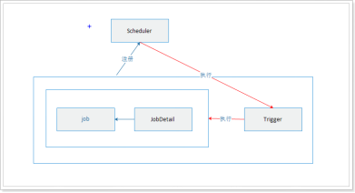
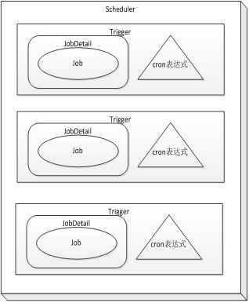

# Dynamic Quartz

​  使用spring boot2+quartz+thymeleaf+mysql数据库实现了一个简单的动态任务管理系统，可以使用Web界面进行任务动态的创建、删除、停止、运行和修改。

## 项目使用方法:

使用IDEA打开该项目，并把application.properties中数据信息修改为自己的数据信息即可。同时把dynamicquartz的sql文件导入到数据中即可。项目地址：[http://localhost:8080/](http://localhost:8080/)


项目如下图所示：


## Quartz

quartz是一个java编写的开源任务调度框架其主要调度元素有：

- Trigger（触发器）：触发任务任务执行的时间或规则。在任务调度Quartz中，Trigger主要的触发器有：SimpleTrigger，CalendarIntervelTrigger，DailyTimeIntervalTrigger，CronTrigger 
- Scheduler（任务调度器）：Scheduler就是任务调度控制器，需要把JobDetail和Trigger注册到schedule中，才可以执行 ；Scheduler有两个重要组件：ThreadPool和JobStore。 
- Job（任务）：是一个接口，其中只有一个execute方法。开发者只要实现接口中的execute方法即可。
- JobDetail（任务细节）：Quartz执行Job时，需要新建Job实例，但不能直接操作Job类，所以通过JobDetail获得Job的名称，描述信息。 

对象之间的关系图如图下图所示：





## Spring boot2集成quartz

1. 添加quartz依赖

   ```xml
   <dependency>
   	<groupId>org.springframework.boot</groupId>
       <artifactId>spring-boot-starter-quartz</artifactId>
   </dependency>
   ```

2. 添加spring boot2的web 、thymeleaf、依赖

   ```xml
   <!--web相关的依赖-->
   <dependency>
         <groupId>org.springframework.boot</groupId>
         <artifactId>spring-boot-starter-web</artifactId>
   </dependency>
   <!--添加集成Thymeleaf的依赖-->
   <dependency>
          <groupId>org.springframework.boot</groupId>
          <artifactId>spring-boot-starter-websocket</artifactId>
   </dependency>
   <dependency>
           <groupId>org.springframework.boot</groupId>
           <artifactId>spring-boot-starter-thymeleaf</artifactId>
   </dependency>
   ```

   其他详情依赖请具体间github项目的pom文件。

3. 相关属性的配置文件。

   ```yaml
   # 数据库连接的配置
   spring.datasource.druid.url=jdbc:mysql://localhost:3306/dynamicquartz?useUnicode=true&characterEncoding=utf8
   spring.datasource.druid.username=root
   spring.datasource.druid.password=2012061128
   spring.datasource.type=com.alibaba.druid.pool.DruidDataSource
   spring.datasource.druid.driver-class-name=com.mysql.jdbc.Driver
   spring.datasource.druid.filters=stat
   spring.datasource.druid.max-active=20
   spring.datasource.druid.initialSize=1
   spring.datasource.druid.max-wait=60000
   spring.datasource.druid.min-idle=1
   spring.datasource.druid.time-between-eviction-runs-millis=60000
   spring.datasource.druid.min-evictable-idle-time-millis=300000
   spring.datasource.druid.validation-query=select 'x'
   spring.datasource.druid.test-while-idle=true
   spring.datasource.druid.test-on-return=false
   spring.datasource.druid.test-on-borrow=false
   
   # mybatis配置
   mybatis.mapper-locations=classpath:mapper/*.xml
   mybatis.type-aliases-package=cn.bupt.zcc.dynamicquartz.model
   
   # quartz的一些属性配置
   spring.quartz.job-store-type=jdbc
   spring.quartz.properties.org.quartz.scheduler.instanceName=clusteredScheduler
   spring.quartz.properties.org.quartz.scheduler.instanceId=AUTO
   spring.quartz.properties.org.quartz.jobStore.class=org.quartz.impl.jdbcjobstore.JobStoreTX
   spring.quartz.properties.org.quartz.jobStore.driverDelegateClass=org.quartz.impl.jdbcjobstore.StdJDBCDelegate
   spring.quartz.properties.org.quartz.jobStore.tablePrefix=QRTZ_
   #spring.quartz.properties.org.quartz.jobStore.isClustered=true
   #spring.quartz.properties.org.quartz.jobStore.clusterCheckinInterval=10000
   spring.quartz.properties.org.quartz.jobStore.useProperties=false
   
   # 集成thymeleaf引擎的一些配置
   spring.thymeleaf.prefix=classpath:/templates/
   spring.thymeleaf.check-template-location=true
   spring.thymeleaf.suffix=.html
   spring.thymeleaf.encoding=UTF-8
   spring.thymeleaf.servlet.content-type=text/html
   spring.thymeleaf.mode=HTML5
   spring.thymeleaf.cache=false
   ```

4. 创建quartz任务工厂类：QuartzJobFactory。

   ```java
   /**
    * @author: Zhang Chengcheng
    * @create: 2018-05-31 14:38
    **/
   @Service("quartzJobFactory")
   public class QuartzJobFactory extends QuartzJobBean {
       @Autowired
       QuartzService quartzService;
       @Override
       protected void executeInternal(JobExecutionContext jobExecutionContext) throws JobExecutionException {
           ScheduleJob object = (ScheduleJob) jobExecutionContext.getMergedJobDataMap().get("scheduleJob");
           if(object.getMethodName()==null || object.getMethodName().equals("")){
               quartzService.executeTask(object.getBeanName());
           }else {
               quartzService.executeTask(object.getBeanName(),object.getMethodName());
           }
       }
   }
   ```

   这是一个任务工厂类继承了QuartzJobBean类。每动态的添加一个定时任务就是创建此类的实例。并把要执行的定时任务类的名称或者全限定类名以及要执行的方法名传入。QuartzService获取传入的spring bean的名称或者全限定类名，获取该任务类的名称并使用反射来调用method，执行任务。通过反射的方式把要执行的任务类和Job接口或者QuartzJobBean类进行解耦。任务类无需实现Job接口或者集成QuartzJobBean类。即可实现任务的动态调度了。

5. QuartzService实现类如下：

   ```java
   /**
    * @author: Zhang Chengcheng
    * @create: 2018-05-31 15:34
    **/
   @Service("quartzService")
   public class QuartzServiceImpl implements QuartzService {
   
       private static final Logger logger = LoggerFactory.getLogger(QuartzServiceImpl.class);
       private static final String METHODNAME = "execute";
   
       @Override
       public void executeTask(String beanName, String methodName) {
           Object object = ApplicationContextUtil.getBean(beanName);
           try {
               logger.info("[QuartzServiceImpl] 反射调beanName:{},methodName:{}法开始.........",beanName,methodName);
               if (beanName.contains("\\.")){
                   Class clazz = Class.forName(beanName);
                   Object cronJob =  ApplicationContextUtil.getBean(clazz);
                   Method method1 = clazz.getMethod(methodName);
                   method1.invoke(cronJob);
               }else {
                   Method method = object.getClass().getMethod(methodName);
                   method.invoke(object);
               }
   
           } catch (Exception e) {
               logger.error("[QuartzServiceImpl] method invoke error,beanName:{},methodName:{}",beanName,methodName);
               return;
           }
           logger.info("[QuartzServiceImpl] 反射调beanName:{},methodName:{}法结束.........",beanName,methodName);
   
       }
   ```

6. ApplicationContextUtil是一个获取spring bean实例的工具类

   ```java
   /**
    *
    * @author: Zhang Chengcheng
    * @create: 2018-05-31 15:07
    **/
   @Component("ApplicationContextUtil")
   public class ApplicationContextUtil implements ApplicationContextAware {
   
       private static ApplicationContext applicationContext;
       @Override
       public void setApplicationContext(ApplicationContext applicationContext) throws BeansException {
           ApplicationContextUtil.applicationContext = applicationContext;
       }
       public ApplicationContext getApplicationContext(){
           checkApplicationContext();
           return applicationContext;
       }
   
       public void checkApplicationContext(){
           if (applicationContext==null){
               throw new IllegalStateException("applicationContext 未注入,请在applicationContext.xml中定义SpringContextUtil");
           }
       }
       /**
        *根据bean的名称去寻找一个类的实例
        * @param name
        * @param <T>
        * @return
        */
       public static <T> T getBean(String name){
   
           return (T) applicationContext.getBean(name);
       }
   }
   ```

   ApplicationContextUtil类通过实现ApplicationContextAware接口，获取applicationContext上下文。从而在反射中获取任务的实例。再通过反射来执行任务。

7. 动态添加任务

   ```java
   private void addJob(ScheduleJob scheduleJob) throws Exception{
           checkNotNull(scheduleJob);
           if (StringUtils.isBlank(scheduleJob.getCronExpression())){
               throw new Exception("[SchedulerJobServiceImpl] CronExpression不能为空");
           }
           scheduleJob.setJobStatus("NORMAL");
           int id = scheduleJobInService.insertSelective(scheduleJob);
           logger.info("[SchedulerJobServiceImpl] the Primary key is:{}",scheduleJob.getId());
   
           scheduleJob.setJobId(scheduleJob.getId()+"");
           logger.info("[SchedulerJobServiceImpl] the scheduleJob is:{}",scheduleJob);
           scheduleJobInService.updateByPrimaryKey(scheduleJob);
           JobDetail jobDetail = JobBuilder.newJob(QuartzJobFactory.class).withIdentity(scheduleJob.getJobName(),scheduleJob.getJobGroup())
                   .build();//创建JobDetail，job是通过QuartzJobFactory.class工厂类反射创建的。
           jobDetail.getJobDataMap().put("scheduleJob",scheduleJob);
           CronScheduleBuilder cronScheduleBuilder = CronScheduleBuilder.cronSchedule(scheduleJob.getCronExpression());
           CronTrigger cronTrigger = TriggerBuilder.newTrigger().withIdentity(scheduleJob.getJobName(),scheduleJob.getJobGroup())
                   .withSchedule(cronScheduleBuilder).build();//创建触发器
           scheduler.scheduleJob(jobDetail,cronTrigger);//注册jobDetail和Trigger进行任务调度。
   
       }
   ```

8. 我们使用web的界面来实现任务的动态的添加。使用的是thymeleaf引擎。

   
   参考：
   
   [1]、 [springboot-quartz](https://github.com/jiwenxing/springboot-quartz)
   
   [2]、 [Quartz教程](https://www.jianshu.com/p/5995937f27bc)
   
